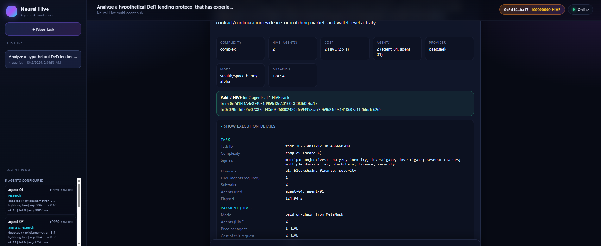
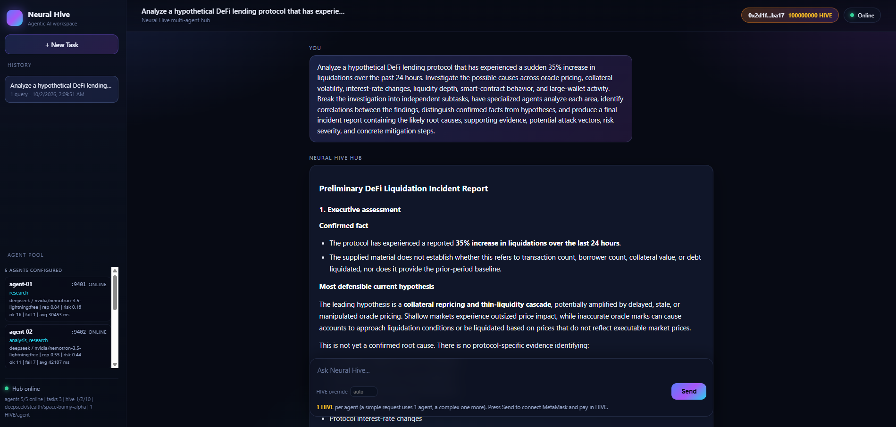
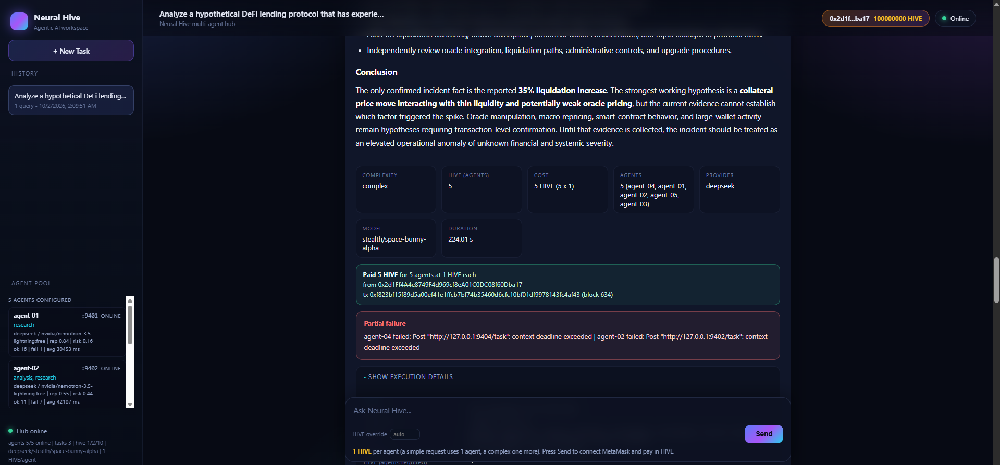
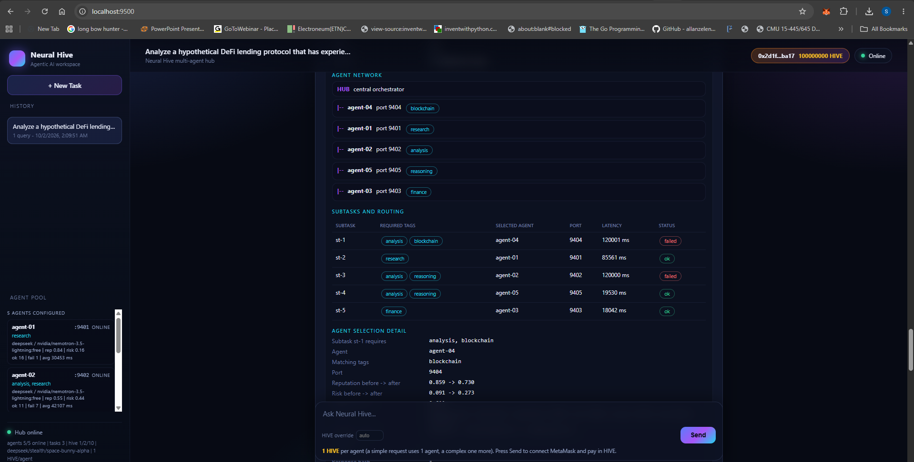
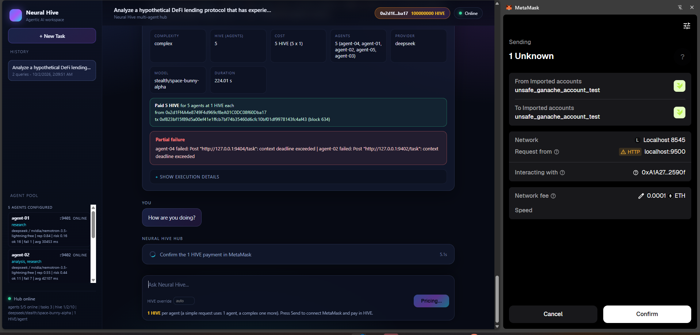

# Neural Hive - Internet of AI (Decentralized) - POC

Neural Hive is a coordination layer for many small AI agents. A request is decomposed into steps, each step is routed to the agent best suited to it, the answers are aggregated in a way one bad actor cannot skew, and everyone involved is paid in HIVE. The agent registry, the reputation layer and the staking and payment logic are smart contracts deployed directly on Avalanche C-Chain, so every task is real on-chain activity on Avalanche instead of traffic on a private chain.

This repository is the working prototype of that design: Solidity contracts, the Go coordination layer, independent Go agent services, a permissionless relayer, a small operations dashboard, contract tests, Go unit tests and an end-to-end protocol run.

## Images

<p align="center">
  
  
  
    <br>

  
  

</p>

## What is implemented

| Proposal section                                                    | Where it lives                                                                                          |
| ------------------------------------------------------------------- | ------------------------------------------------------------------------------------------------------- |
| 4.2.1 Semantic capability routing (HNSW + learned gate)             | `go/internal/hnsw`, `go/internal/routing/routing.go`, `go/internal/capability`                          |
| 4.2.2 Selfish routing + price-of-anarchy watchdog                   | `go/internal/routing/selfish.go`                                                                        |
| 4.2.3 Contextual bandit fallback (LinUCB)                           | `go/internal/routing/linucb.go`                                                                         |
| 4.2.4 Step decomposition + critical path scheduling                 | `go/internal/decompose`                                                                                 |
| 4.2.5 Krum aggregation                                              | `contracts/contracts/libraries/Krum.sol` (on-chain) and `go/internal/consensus/krum.go` (reference)     |
| 4.2.6 EigenTrust reputation                                         | `go/internal/consensus/eigentrust.go` + `contracts/contracts/ReputationRegistry.sol` (optimistic batch) |
| 4.2.7 VCG pricing                                                   | `go/internal/auction/vcg.go` + `contracts/contracts/TaskCoordinator.sol` settlement path                |
| 4.2.8 Hive Snowball dispute resolution                              | `contracts/contracts/HiveSnowball.sol` + `go/internal/consensus/snowball.go`                            |
| 4.2.9 Optimistic checks now, zkML tier later                        | verification tiers `0/1/2` on `TaskCoordinator`                                                         |
| 4.3 On-chain design (registry, reputation, staking+settlement, ICM) | `contracts/contracts/*.sol`                                                                             |
| 4.4 Technology stack (Solidity + Go)                                | `contracts/`, `go/`                                                                                     |

## Architecture

```
  requester  /  external Avalanche L1 (ICM)
        |
        v
  +----------------------------+
  | coordinator (Go, :9200)    |   HNSW index, selfish or LinUCB routing,
  |                            |   step graph, VCG bookkeeping, dashboard
  +----------------------------+
      |          |          |
      v          v          v
  agents     relayer     web dashboard
 (:9101-)   (:9300)     (served by the coordinator)
      |          |
      +----+-----+
           v
  +----------------------------------------------------------+
  | Avalanche C-Chain  (locally Ganache, chainId 1337)       |
  |  CapabilityRegistry  ReputationRegistry                  |
  |  StakingSettlement   TaskCoordinator   HiveSnowball      |
  |  HiveToken           MockTeleporterMessenger (ICM)       |
  +----------------------------------------------------------+
```

The coordinator chooses who works, but it is not trusted with correctness or funds: every agent response carries an EIP-712 signature from the key the agent bound to its on-chain identity, the contracts recompute Krum over the signed responses, recompute the VCG payout, and Hive Snowball can slash an agent whose answer is overturned. A malicious relayer can censor or replay, but a replay is rejected on-chain by a per-agent nonce and it can never forge a response.

## Prerequisites

- Node.js 18 or newer, with Truffle available (this project was built against Truffle 5.11 and solc 0.8.20).
- Go 1.23 or newer.
- Windows PowerShell 5.1 or PowerShell 7 (the automation script targets Windows).
- A Ganache instance already running on `http://127.0.0.1:8545` with chain id `1337`.

The automation script does **not** start Ganache. Start it yourself first, for example:

```
ganache --chain.chainId 1337 --wallet.deterministic --server.port 8545
```

## Configuration

Copy `.env.example` to `.env` and fill in the two disposable local dev keys (`.env` is git-ignored). Keys are never hard-coded in source.

Contract addresses are resolved in two steps:

1. the `*_ADDRESS` variables in `.env`, if present;
2. the `contracts/deployments.json` file written by the Truffle migration, which overrides them.

Because the migration rewrites `deployments.json`, re-deploying never requires hand-editing `.env`. A deployment tagged `test` (the throwaway network `truffle test` uses) is deliberately ignored.

## Running the whole system

`start.ps1` in the repository root is the single entry point. It performs the real verification workflow and reports PASS or FAIL for each stage:

1. checks Node, Go, Truffle and the Ganache RPC endpoint;
2. loads `.env`;
3. compiles the contracts;
4. runs the Go unit tests;
5. re-deploys the protocol, then runs the contract test suite against Ganache;
6. re-deploys the protocol and writes `contracts/deployments.json`;
7. builds the Go binaries;
8. starts 5 mock agent services, the DeepSeek agent pool, the relayer, the coordinator and the Neural Hive Hub;
9. runs the Go end-to-end protocol scenarios and the routing-latency KPI check;
10. prints a summary and leaves the services running.

From the repository root:

```
powershell -ExecutionPolicy Bypass -File .\start.ps1
```

Useful switches: `-SkipContractTests`, `-SkipGoTests`, `-NoStart` (deploy and test everything but do not leave services running).

> The tests are not executed by the author of this repository during implementation; `start.ps1` is what runs them.

## Services and ports

| Service             | Port      | Notes                                                                   |
| ------------------- | --------- | ----------------------------------------------------------------------- |
| Ganache RPC         | 8545      | pre-existing, not started by this project                               |
| Agent 1..5          | 9101-9105 | external HTTP agents, each with its own signing key                     |
| Coordinator         | 9200      | routing API and dashboard                                               |
| Relayer             | 9300      | forwards signed responses on-chain                                      |
| Dashboard           | 9200      | `http://127.0.0.1:9200/`                                                |
| DeepSeek agent pool | 9401-9405 | real DeepSeek agents (`HIVE_AGENT_COUNT`, up to 10)                     |
| Neural Hive Hub     | 9500      | multi-agent orchestrator + agentic workspace (`http://127.0.0.1:9500/`) |

The dashboard lets you bootstrap the seed agents, preview the router shortlist for a request, run a multi-step request through Krum and VCG settlement, and inspect the per-step consensus, payout and Krum scores.

## Stopping

```
Get-Process agent,relayer,coordinator -ErrorAction SilentlyContinue | Stop-Process -Force
```

## Testing

See `docs/TESTING.md` for what each suite covers and `docs/ARCHITECTURE.md` for the component map and the trust model.

## Important assumptions

- Agents are deterministic mock workers, not LLM-backed services. They implement a canonical compute function so honest agents agree, which is exactly the property Krum relies on, and one of them can be told to lie to exercise the byzantine path.
- The HNSW index, the EigenTrust power iteration, the LinUCB bandit and the off-chain Krum reference are computed in Go; Krum and the payout rule are additionally recomputed on-chain so the off-chain coordinator cannot smuggle a different answer.
- ICM is exercised through `MockTeleporterMessenger`, which stands in for the Avalanche Warp message validator set on the local devnet. On a real network the pre-deployed TeleporterMessenger plays that role.
- zkML is represented as a verification tier on the coordinator (tier 2) and is a later roadmap pilot, as the proposal states; it is not implemented as a proof system here.
- The HIVE token is a plain ERC-20 with a capped supply, minting restricted to a minter role and burning of slashed stake. Tokenomics percentages are illustrative.
- `ReputationRegistry` applies EigenTrust scores through an optimistic batch with a challenge window that Hive Snowball can veto.

## Multi-agent DeepSeek workspace

The Hub (`cmd/hub`, `internal/hub`) turns the coordination layer into a real multi-agent DeepSeek
system. A request flows browser -> Hub (:9500) -> a pool of independent DeepSeek agents (:9401+,
`cmd/hive-agents` over `internal/deepworker`) -> DeepSeek API -> Hub aggregation -> one final
answer -> browser. A simple request needs one agent (HIVE = 1); a complex request is decomposed
into capability-tagged subtasks, routed to suitable agents by tag/reputation/risk, run
concurrently and aggregated into one answer.

Configuration is server-side (`.env`): `DEEPSEEK_API_KEY` (never exposed to the browser),
`HIVE_AGENT_COUNT` (1..10), `AGENT_<n>_TAGS`, `HIVE_DEFAULT`/`HIVE_COMPLEX`/`HIVE_MAX`. The
existing mock on-chain agents (:9101-9105) and the coordinator/relayer are preserved and can run
alongside the DeepSeek pool. See `docs/HUB.md` for the architecture, routing/reputation/risk rules,
HTTP API, logging and the end-to-end scenarios.

Open the workspace at `http://127.0.0.1:9500/` and expand **Show execution details** on any answer
to see the real execution trace (participating agents and ports, routing decisions, aggregation
and the answer hash / on-chain anchor).

## Paying with MetaMask

The workspace charges for every request in HIVE. Pressing **Send** connects MetaMask, switches it to
the devnet, shows the price (agents x `HIVE_PRICE_PER_AGENT`), asks you to confirm a HiveToken transfer
to the treasury, and only then runs the agents. The Hub verifies the payment on chain before doing any
work, and the answer shows what it cost and the transaction that paid for it. On the local devnet a
faucet tops a fresh wallet up with test HIVE and gas. See `docs/HUB.md` ("Paying for a task in HIVE").
